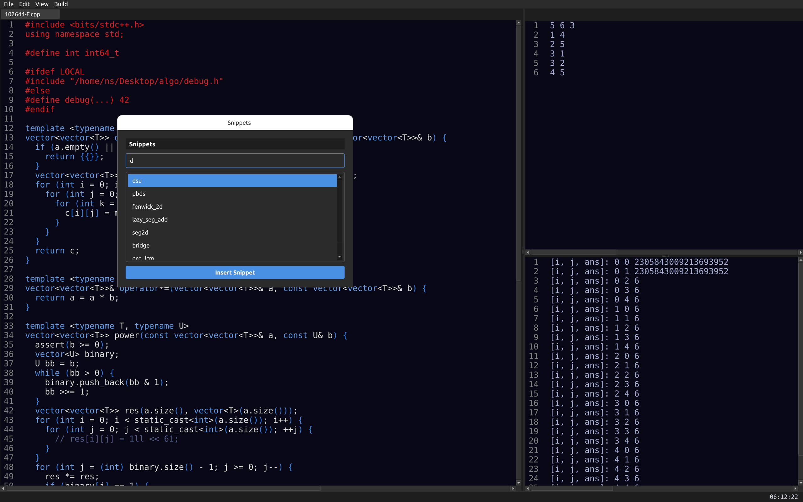
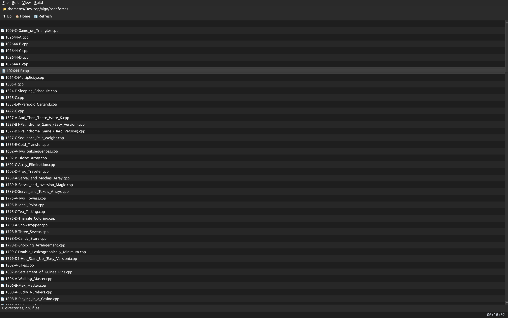
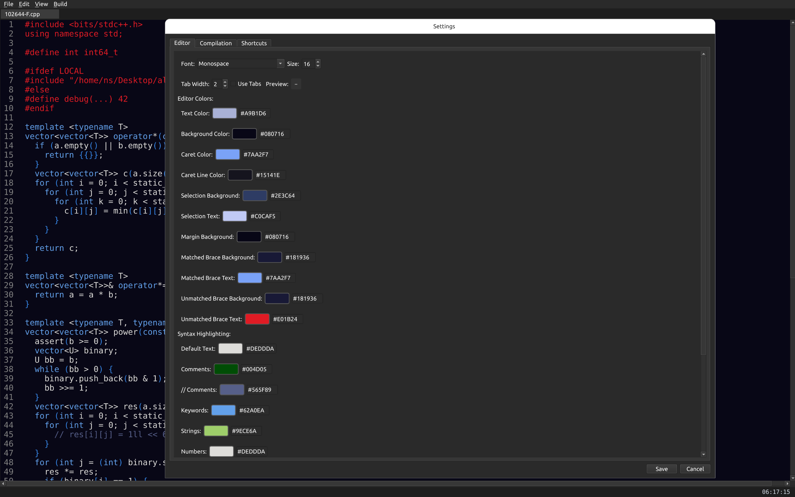

# Competitive Programming Code Editor

A specialized code editor designed for competitive programming, built with Python. This editor aims to enhance the coding experience with features tailored for competitive programmers.






## Features

- 📝 Code Editor
  - Syntax highlighting for multiple programming languages
  - Line numbering
  - Auto-indentation
  - Code folding
  - Multiple tabs support

- 📁 File Browser
  - Quick access to files and directories
  - Create, rename, and delete files
  - Project structure view

- 🎯 Competitive Programming Specific Features
  - Code snippets library
  - Custom templates
  - Test case management
  - Problem statement viewer
  - Quick input/output testing

- ⚡ Shortcuts
  - Customizable keyboard shortcuts
  - Common coding operations
  - Quick snippet insertion

- 🎨 Additional Features
  - Customizable themes
  - Font size adjustment
  - Auto-save functionality
  - Status bar with useful information

## Requirements

- Python 3.8 or higher
- Required Python packages (install using pip):
  ```bash
  pip install -r requirements.txt
  ```

## Installation

1. Clone the repository
   ```bash
   git clone https://github.com/yourusername/cp-code-editor.git
   cd cp-code-editor
   ```

2. Install dependencies
   ```bash
   pip install -r requirements.txt
   ```

3. Run the application
   ```bash
   python main.py
   ```

## Usage

1. Launch the application using the command above
2. Use File -> New or Ctrl+N to create a new file
3. Write your code in the editor
4. Save using File -> Save or Ctrl+S
5. Use the integrated terminal for compilation and execution
